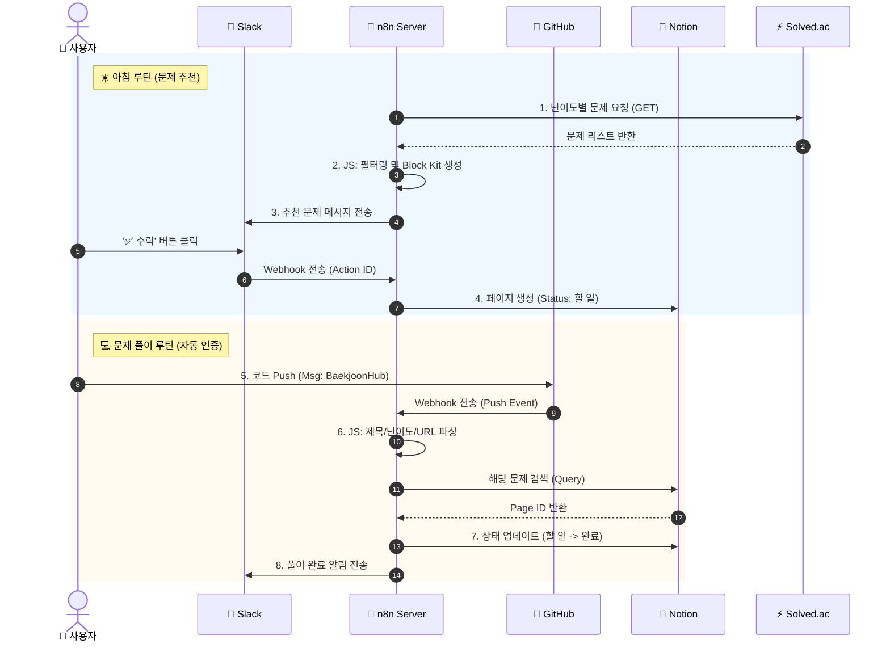

```mermaid
sequenceDiagram
    autonumber
    actor User as 👤 사용자
    participant Slack as 💬 Slack
    participant n8n as 🤖 n8n Server
    participant GitHub as 🐙 GitHub
    participant Notion as 📝 Notion
    participant Solved as ⚡ Solved.ac

    %% 1. 아침 루틴 (배경색: 연한 하늘색)
    rect rgb(240, 248, 255)
    note right of User: ☀️ 아침 루틴 (문제 추천)
    n8n->>Solved: 1. 난이도별 문제 요청 (GET)
    Solved-->>n8n: 문제 리스트 반환
    n8n->>n8n: 2. JS: 필터링 및 Block Kit 생성
    n8n->>Slack: 3. 추천 문제 메시지 전송
    User->>Slack: '✅ 수락' 버튼 클릭
    Slack->>n8n: Webhook 전송 (Action ID)
    n8n->>Notion: 4. 페이지 생성 (Status: 할 일)
    end

    %% 2. 문제 풀이 루틴 (배경색: 연한 주황색)
    rect rgb(255, 250, 240)
    note right of User: 💻 문제 풀이 루틴 (자동 인증)
    User->>GitHub: 5. 코드 Push (Msg: BaekjoonHub)
    GitHub->>n8n: Webhook 전송 (Push Event)
    n8n->>n8n: 6. JS: 제목/난이도/URL 파싱
    n8n->>Notion: 해당 문제 검색 (Query)
    Notion-->>n8n: Page ID 반환
    n8n->>Notion: 7. 상태 업데이트 (할 일 -> 완료)
    n8n->>Slack: 8. 풀이 완료 알림 전송
    end
```
